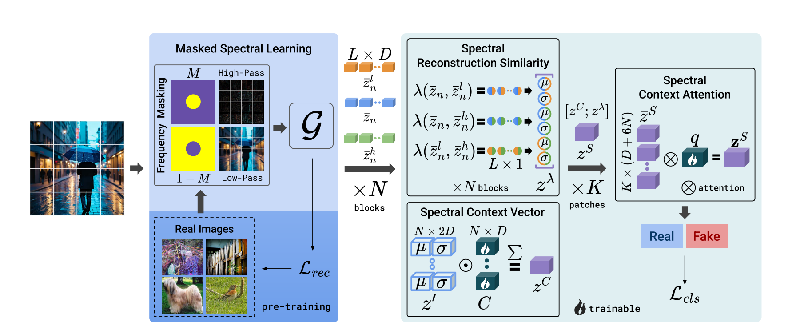
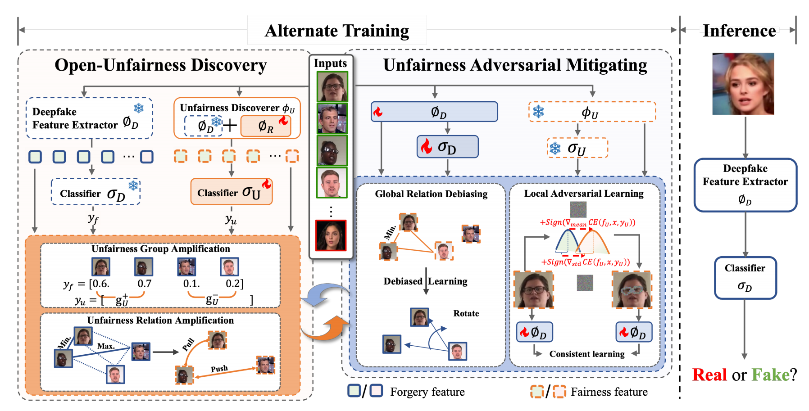
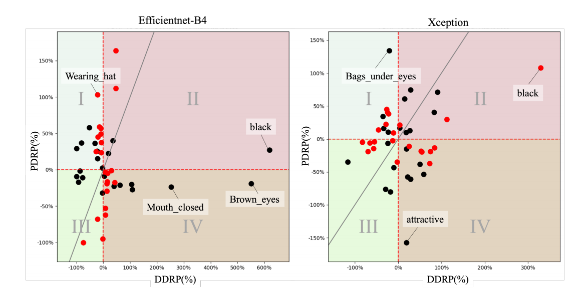
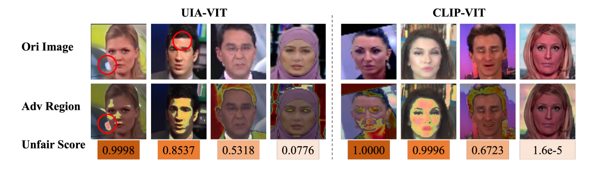
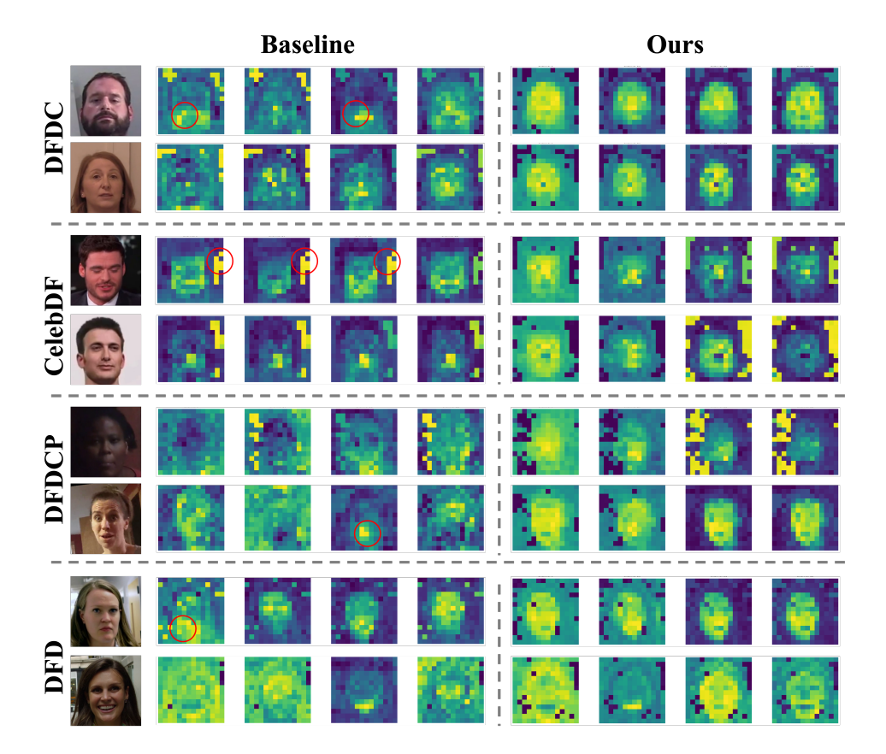

1. 对于传统对抗训练和流式对抗训练的更深刻理解
2. 线性预热 + 余弦衰减
3. 下一步计划: 傅里叶变换的频域观察
4. 下载COCO, Open Images, ImageNet数据集
5. 思考点: 传统模型 固定分辨率传入会损失特征

## Any-resolution AI-generated image detection by spectral learning
### 1. 方法
### 预处理部分
#### 已知的方法告诉我们,当我们利用AI建模真实图像时,其准确度会比其直接生成一张图像准确率更低
#### 该文章将真实图像的频谱分布作为区分点, 在输入图像时, 分离低频部分和高频部分, 然后让模型同时学习从低频重建高频和从高频重建低频(利用的是ViT: vision transformer, 训练目标是,最小化重构的频谱的原始频谱的距离),学习完成后,模型能够捕捉到真实图片和AI生成图片的不同之处, 即学习到真实图像的统计规律(因为AI生成的图片重建后不符合ViT学到的规律)
#### 为了量化这种差异, 文章提出了SRS(Spectral Reconstruction Similarity)来量化这个差异,分别输入transformer计算
    原始图像与高频分量, 
    原始图像与低频分量,
    高频分量与低频分量的余弦相似度, 

    然后分别得到他们的平均值(mean)和标准差(deviation)

    那么就会有6N(3 * 2)维度的向量生成, 这就是SRS
#### 对于不同的图像,防止对某一类图片拟合,SCV(Spectral Context Vector)会根据不同频谱图像的能量分布不同
    如
    纹理丰富图像 -- 高频重要
    平坦区域图像 -- 高频没意义
#### SCV 是基于ViT各层输出特征(投影后)的均值和标准差，通过可学习的注意力机制构建的，它为SRS提供上下文权重，帮助模型决定哪些 SRS 值更重要。
#### SCV会为SRS提供语境
#### 对于不同的分辨率, 传统的模型受限于固定分辨率传入, 文章提出了SCA(Spectral Context Attention)进行解决， 将图片分成多个固定尺寸的补丁， 独立计算每个补丁的频谱特征， 然后融合每个块的SRS特征，而且其复杂度仅仅是与分块数的线性关系
#### 其流程图如下

## Open-Unfairness Adversarial Mitigation for Generalized Deepfake Detection

## 思想

提出 **AdvOU（Adversarial Open-Unfairness Discovery and Mitigation Network）**，用于**自适应发现并缓解深度伪造检测器中不可预见的偏见（open-unfairness）**，不依赖预定义的敏感属性（如种族、性别），适用于多种检测模型

比如说：有些检测器对于猩猩和人的分类识别正确率是80%，但是总体的是95%, 另一个检测器总体的识别正确率都是92%(总体也是92%). 某团队在应用来做人类与猩猩的识别研究时不知道这个,就拿着前面那个去识别了,显然, 这是很坏的了

---

### 方法

AdvOU 包含两大核心模块，**交替训练**：

1. **Open-Unfairness Discovery (OUD)**：发现并放大检测器中的不公平特征。
2. **Unfairness Adversarial Mitigation (UAM)**：通过对抗学习缓解已发现的不公平特征。

整体结构如图：

- 冻结的检测器 ( phi_D )
- 可训练的 **Unfairness Regulator (UR)** ( phi_R )
- 不公平分类器 ( sigma_U )
- 交替优化：OUD 训练 UR，UAM 训练检测器

---

###  1. Open-Unfairness Discovery (OUD)

#### Unfairness Regulator (UR)

- 轻量级瓶颈结构（类似 LoRA）
- 插入检测器各块中，提取不公平相关特征

#### Unfairness Amplification Learning (UAL)

##### 1. Unfairness Group Amplification (UGA)

- 将样本分为两组：( g_U^+ )（含不公平特征）和 ( g_U^- )（不含）
- 使用 **Equal Opportunity Violation (EOV)** 损失放大组间差异：

##### 2. Unfairness Relation Amplification (URA)

- 对同标签样本，基于特征相似度找出最近和最远样本
- 放大不公平关系：

最终得到 UAL 损失

---

###  2. Unfairness Adversarial Mitigation (UAM)

####  Global Relation Debiasing

- 对同标签样本，基于不公平特征选择最近样本
- 随机选一个 pivot 样本，旋转该关系以消除偏见：

####  Local Adversarial Learning (LAL)

- 对共享的浅层特征 ( f_s ) 进行对抗扰动
- 使用不公平分类器计算梯度，扰动均值和标准差：

- 强制检测器对原始和扰动特征输出一致：

最终得到 UAM 损失

### 总结：方法大致为
    不断检测然后发现模型存在的不公平，然后通过(UR)得到不公平的特征，之后又通过(UGA)将样本划分为不公平正组(模型容易误判)和不公平负组(模型精度较高,就是不容易误判),在之后用EOV量化两组之间的差异,根据EOV知道是否真的存在不公平

    假如存在不公平(EOV数值判定其存在内部的不公平),通过URA找到两组中相似的的图片,对某图片划分它的最近(相似)(X_ni)和最远(最不相似)(X_fi),然后通过URA扩大最近的那些图片与本图的距离,降低最远的那些图片到本图的距离

    之后GRD会来旋转原来的图片关系, 彻底破坏这种关系,然后针对的进行LAL对抗训练(LAL是针对于不公平特征的攻击),缓和这种不公平
---

### 主要结果
- 在多个数据集上超越 SOTA
- 有效提升检测器的泛化能力和公平性
- 对多种检测器(EfficientNet、F3Net、UIA-ViT)均有提升

---

### 可视化分析

- **不公平属性分布图**：AdvOU 显著减少四象限中的不公平属性

- **对抗扰动图**：不同模型对不公平特征的响应不同（如亮点、背景）

- **注意力图**：AdvOU 使模型更关注面部区域，减少对背景等非因果特征的依赖
