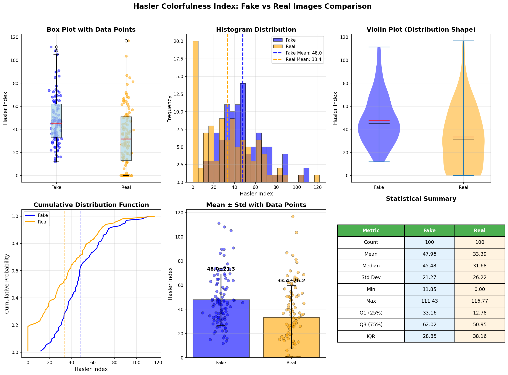
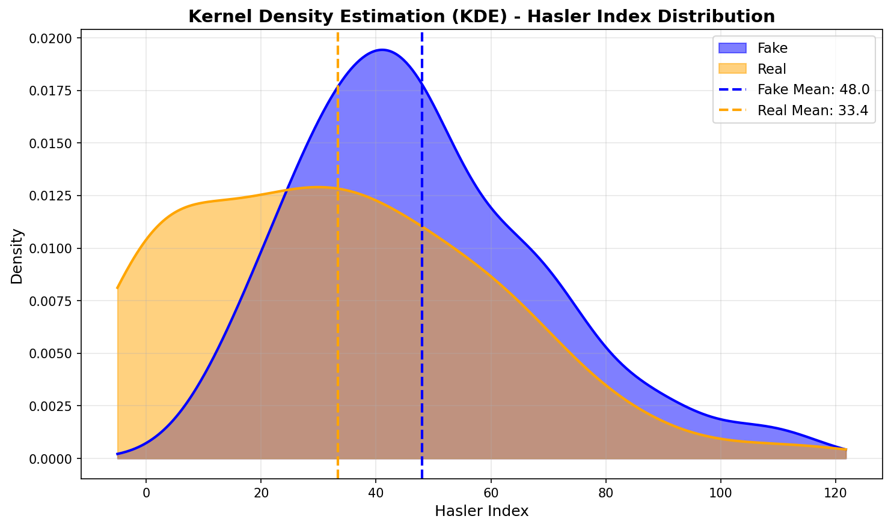
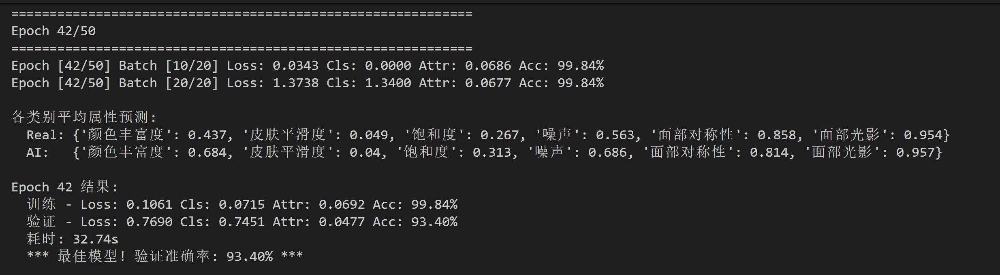

## 一、Self-Supervised AI-Generated Image Detection: A Camera Metadata Perspective

---

### 1. 研究背景

AI生成技术已能够产生高度逼真的图像，开发可靠的检测方法成为迫切需求。

现有检测方法主要依赖特定生成模型的内部机制（如GAN的上采样伪影、扩散模型的去噪轨迹），导致其泛化能力受限：针对GAN设计的检测器难以检测扩散模型生成的图像，反之亦然。

本文提出一种**不依赖AI生成样本**的自监督方法，通过相机元数据（EXIF标签）学习真实摄影图像的内在规律。

**前置任务（Pretext Task）**：仅使用真实图像，通过分类任务（如相机型号、场景类型）和排序任务（如焦距、光圈值）对EXIF标签进行预测，训练特征提取器。该方法主要聚焦于高频残差和相机本身的成像规律，而非语义信息。

---

### 2. 检测框架

**单类检测（SDAIE）**

采用高斯混合模型（GMM）对真实图像的特征分布进行建模，将低相似度样本判定为AI生成图像。

**二分类检测（SDAIE+）**

以自监督特征提取器作为正则化器训练分类器，提升泛化能力。此处正则化的含义为：强制模型最小化单类检测学到的真实图像特征与二分类检测训练过程中提取特征之间的L2距离（L2距离越小表示相似度越高），从而约束模型学习与相机成像规律一致的表示。该机制可防止二分类器过拟合到ProGAN的特定伪影，确保模型始终提取与相机内禀特性相关的特征。

---

### 3. 核心思想

设备信息（品牌与型号）、测光模式、曝光模式、白平衡模式、曝光补偿、ISO感光度、光圈值、曝光时间、光圈系数、快门速度、焦距等信息并非存储于像素数据中，而是专门存储于metadata区域。

论文的核心方法为单分类检测与二分类检测。通过单分类检测的训练，检测器学习到相机成像相关的EXIF特征分类能力，输出对数似然分数（即根据输出的分数判断相机相关信息，注意仅使用真实图片进行训练）。

训练完成后，去除SDAIE的预测头，对其余层进行正则化（使SDAIE可被训练但受约束），转化为二分类器，可对图片是否符合真实EXIF标签做出判断。

---

## 二、关于Noise和ELA分析的实验笔记

### 3.1 Noise图像观察

在Noise图像中，Fake图片与Real图片呈现以下差异：

**颜色特征**：Fake图片颜色更加鲜艳，尤其在边缘区域常出现不合时宜的色彩；Real图片边缘则通常为纯色。Fake图片边缘区域更加白亮。

**细节特征**：人物脸部细节方面，Fake图片面部较为光滑，噪点较少；Real图片则存在较多细小噪点，推测原因可能是人类面部本身并非完全光滑。Fake图片中的体毛（如头发）未呈现根根分明的状态，而Real图像中头发清晰可辨。推测AI尚未充分学习头发反光特性，同理面部也会反光，因此Real图片面部噪点较多，而Fake图片更加光滑。

**表情与语义**：部分Fake图片表情存在异常，如fake034中家属的表情不符合情境。

**光照处理**：Fake图片在描述强光或反光场景时倾向于使用强烈色彩，可能导致边缘特别白亮、色彩特别丰富。Fake图片中金属质地反光部分在Noise图像下呈现异常特征。

**注**：MFR（Multi-Filter Residual）对AI生成图像的特定痕迹敏感：GAN呈现棋盘格效应，Diffusion模型呈现过渡平滑区域及不自然的纹理高频噪声，VAE呈现模糊边界的噪声不一致性。

---

### 3.2 ELA图像观察

在ELA图像中，Fake图片更频繁出现亮色（红色）。根据ELA（Error Level Analysis）的计算公式及原理，亮度的明显不和谐或边缘的不匹配会导致亮色/红色出现。

---

### 3.3 Hasler Index统计分析

针对随机选取的100张真实图片和100张虚假图片，基于Hasler Index生成统计图表：`hasler_comparison_plot.png`和`hasler_kde_plot.png`。

上述图表表明，Fake图片与Real图片在色彩丰富度上存在显著差异。

**统计指标对比**

| 指标 | Fake | Real | 差异 |
|------|------|------|------|
| 平均值 | 47.96 | 33.39 | +43.6% |
| 中位数 | 45.48 | 31.68 | +43.6% |
| 标准差 | 21.27 | 26.22 | Real 更分散 |
| 最小值 | 11.85 | 0.00 | Real 含灰度图 |
| Q1 (25%) | 33.16 | 12.78 | Fake 整体更高 |
| IQR | 28.85 | 38.16 | Real 分布更宽 |

**可视化子图说明**

| 子图 | 说明 | 关键发现 |
|------|------|----------|
| 箱线图+散点 | 展示中位数、四分位数和异常值 | Fake 中位数(45.5) > Real 中位数(31.7) |
| 直方图 | 分布频率对比 | Fake 集中在 40-60，Real 在 0-20 有高峰 |
| 小提琴图 | 分布形状可视化 | Fake 分布更集中，Real 分布更分散（含大量0值） |
| CDF 累积分布 | 累积概率曲线 | Real 在低端累积更快（更多低色彩图） |
| 均值±标准差 | 带数据点的统计柱形图 | Fake: 48.0±21.3, Real: 33.4±26.2 |
| 统计汇总表 | 完整统计指标 | |

---

### 3.4 后续研究方向

1. 将所有图片转换为灰度图像，观察Fake图片经过某些处理后是否会出现奇特的痕迹痕迹。

2. 单类检测范式似乎特别适用于AI生成图片检测。类比而言，人眼在接触AI生成图像之前也未见过此类图像，单类检测范式可模拟人眼的认知过程。可考虑将其与二分类方法结合，以提升检测效果。

## 三、关于本周做的实验

结果如上，训练的是RRDataset提供的训练集和验证集，暂时没有对其他数据集进行测试

代码放在了服务器(/home/zhanglin/zhanglin/baseline/train0315)

思路如下
根据上文第二部分已经发现AI图片与real图片会在颜色丰富度与噪声上有比较明显的区别，再加上对于皮肤平滑度、饱和度、噪声、面部光影的怀疑，AI搜索了简单的量化公式然后进行了归一化，设计了代码进行训练

### 缺陷以及下一步的安排
1. 过拟合：大概存在差不多6%的差距在训练集和验证集，需要采取适当的防过拟合措施
2. 泛化性：从结果来讲，皮肤平滑度，面部光影可能AI与real图像的差距不大，考虑仔细收集资料重新处理对应部分数据，以及对其他属性也尝试用其他方法进行量化；以及寻找更多的benchmark数据集进行测试，防止拟合在这个生成模型甚至数据集
3. 其他的辅助实验：
    1. 考虑只对单个属性进行测试，然后冻结相关参数，最后汇合然后实验
    2. 我感觉准确率还可以更高，这次对于属性的处理还是太粗糙了，下周要专心找找相关论文，搜搜相关算法